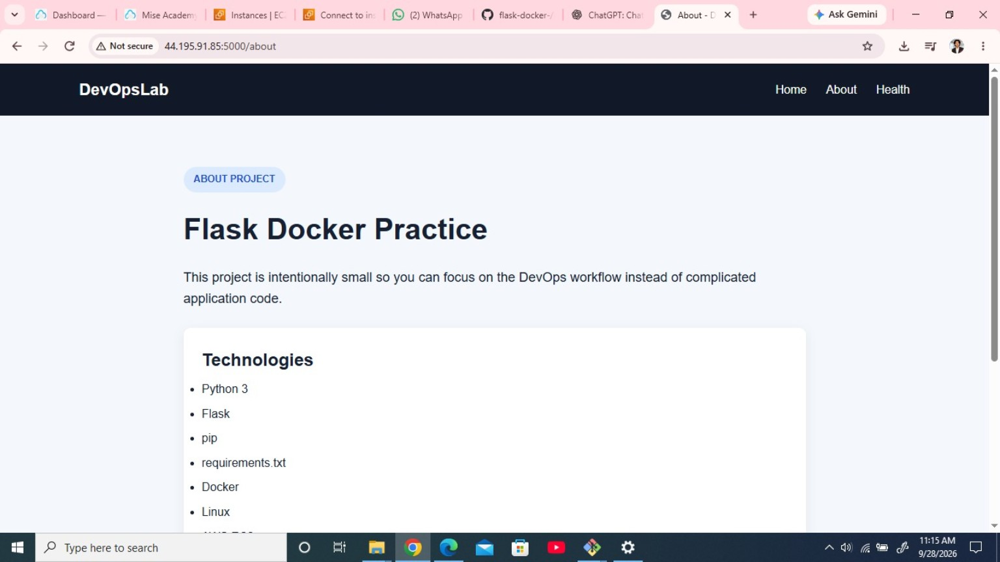
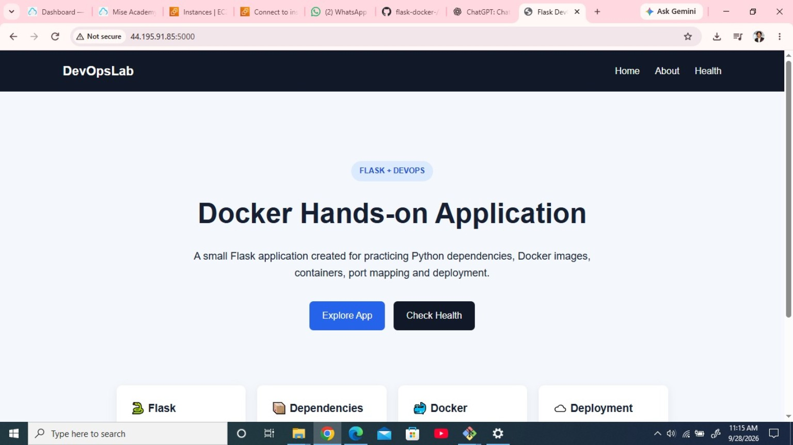

# Flask Docker Hands-on Application

A small Flask + Python web application created for practical DevOps learning.

## Project Preview

### Home Page



### About Page



## Technologies Used

- Python 3
- Flask 3.1.2
- pip
- HTML5
- CSS3
- Docker
- Linux
- AWS EC2

## Project Structure

```text
flask-docker-hands-on/
├── app.py
├── requirements.txt
├── README.md
├── .gitignore
├── templates/
│   ├── index.html
│   └── about.html
├── static/
│   └── style.css
└── screenshots/
    ├── home.png
    └── about.png
```

## Features

- Flask web application
- Home and About pages
- Health-check endpoint
- Responsive UI
- Static CSS
- Dependency management with `requirements.txt`

## Run Locally

```bash
python3 -m venv venv
source venv/bin/activate
pip install -r requirements.txt
python app.py
```

Open:

```text
http://SERVER-IP:5000
```

Health check:

```text
http://SERVER-IP:5000/health
```

## Docker Hands-on

Create the Dockerfile as part of the hands-on practice.

```text
Flask Application
       ↓
requirements.txt
       ↓
Dockerfile
       ↓
Docker Image
       ↓
Docker Container
       ↓
Port Mapping
       ↓
Browser
```

Useful commands to practice:

```bash
docker build
docker images
docker run
docker ps
docker logs
docker exec
docker stop
docker rm
```

Then continue with Docker Hub and AWS EC2 deployment.

## Author

**Waqas Saleem**

DevOps / Cloud Learning Project
